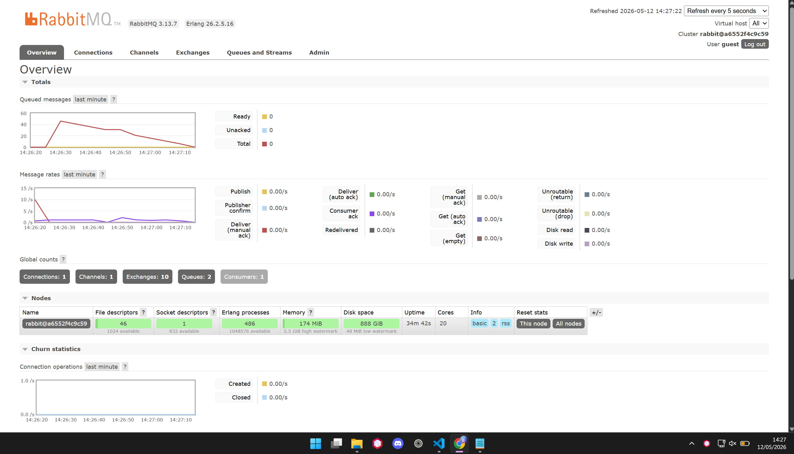
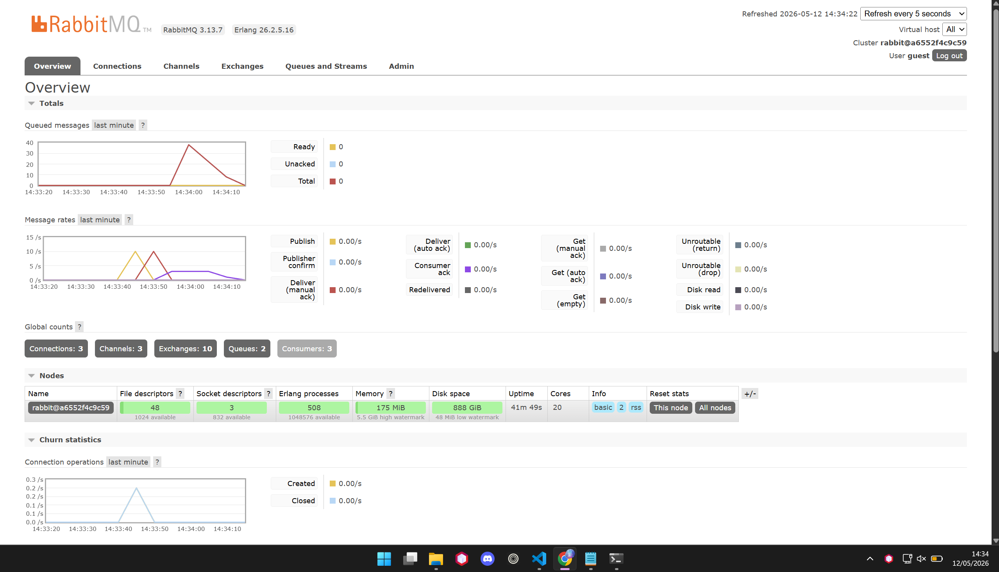

# Reflection

a. amqp adalah singkatan dari Advanced Message Queuing Protocol, yaitu sebuah protokol standar untuk komunikasi antara aplikasi yang menggunakan message broker. AMQP memungkinkan aplikasi untuk mengirim dan menerima pesan secara asinkron, sehingga dapat meningkatkan skalabilitas dan fleksibilitas dalam pengembangan aplikasi. AMQP digunakan oleh banyak message broker seperti RabbitMQ, Apache ActiveMQ, dan lainnya.

b. guest:guest@localhost:5672 adalah format URL yang digunakan untuk menghubungkan aplikasi dengan message broker menggunakan protokol AMQP. jika kita pecah menjadi beberapa bagian, maka:
- guest:guest adalah username dan password yang digunakan untuk autentikasi dengan message broker. Dalam contoh ini, username dan password yang digunakan adalah "guest".
- localhost:5672 adalah alamat dan port dari message broker yang akan dihubungkan. "localhost" merujuk pada komputer lokal tempat aplikasi berjalan, dan "5672" adalah port default yang digunakan oleh RabbitMQ untuk komunikasi AMQP. Jadi, URL ini digunakan untuk menghubungkan aplikasi dengan RabbitMQ yang berjalan di komputer lokal menggunakan username dan password "guest".
Secara keseluruhan, URL ini memiliki format yang serupa dengan database url maupun ssh url, yang terdiri dari username, password, host, dan port. URL ini digunakan untuk mengkonfigurasi koneksi antara aplikasi dan message broker agar dapat berkomunikasi dengan menggunakan protokol AMQP.

# Simulating Slow Subscriber

Dalam gambar di atas, kita dapat melihat bahwa program subscriber berhasil menerima pesan-pesan yang dikirimkan oleh publisher, namun terdapat delay atau keterlambatan dalam menerima pesan-pesan tersebut. Hal ini disebabkan oleh adanya simulasi slow subscriber yang dilakukan dengan menambahkan delay pada program subscriber. Total dalam queue ada 50 entri pada awalnya, ini karena saya menjalankan program sebanyak 10 kali.

# Mitigating Slow Subscriber With Replication

Dalam gambar diatas, kita dapat melihat bahwa program subscriber berhasil menerima pesan-pesan yang dikirimkan oleh publisher, namun sekarang pesan yang mengendap lebih cepat diproses dari sebelumnya, karena kita memiliki 3 consumer yang berjalan sekaligus.
